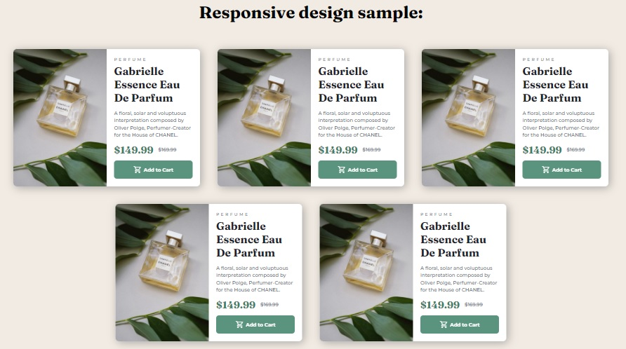
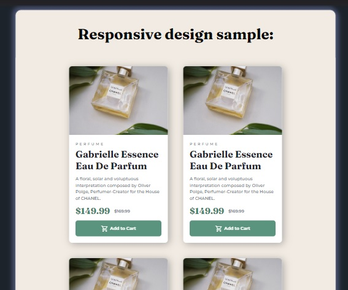
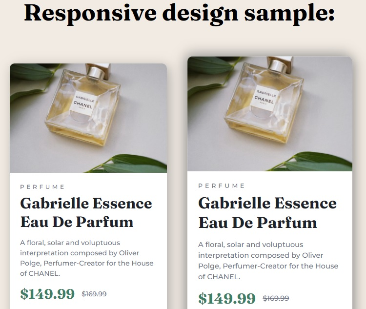

# Frontend Mentor - Product preview card component solution by Julian Flores.

This is a solution to the [Product preview card component challenge on Frontend Mentor](https://www.frontendmentor.io/challenges/product-preview-card-component-GO7UmttRfa). Frontend Mentor challenges help you improve your coding skills by building realistic projects.

## Table of contents

- [Frontend Mentor - Product preview card component solution by Julian Flores.](#frontend-mentor---product-preview-card-component-solution-by-julian-flores)
  - [Table of contents](#table-of-contents)
  - [Overview](#overview)
    - [The challenge](#the-challenge)
    - [Screenshot](#screenshot)
    - [Desktop Version](#desktop-version)
    - [Mobile Version](#mobile-version)
    - [Links](#links)
    - [Built with](#built-with)
    - [Continued development](#continued-development)
    - [Useful resources](#useful-resources)
  - [Author](#author)

## Overview

### The challenge

Your challenge is to build out this product preview card component and get it looking as close to the design as possible.

You can use any tools you like to help you complete the challenge. So if you've got something you'd like to practice, feel free to give it a go.

Your users should be able to:

- View the optimal layout depending on their device's screen size
- See hover and focus states for interactive elements

### Screenshot
### Desktop Version

### Mobile Version

### Links

- Solution URL: [GitHub Repository](https://github.com/JulianFloresDev/Front-End-Proyects/tree/master/product-preview-card-component-main)
- Live Site URL: [Card Component](https://julianfloresdev.github.io/Front-End-Proyects/product-preview-card-component-main/index.html)

### Built with

- Semantic HTML5 markup
- CSS custom properties
- Flexbox
- Mobile-first workflow
- Responsive Design

### Continued development

I would love to complement the component I created with an adaptation to React, so I still need to master this technology.

But for the moment I feel very proud with the results obtained. I hope you like it, I made it with great dedication!

### Useful resources

- [Complete CSS Flex-box Guide](https://css-tricks.com/snippets/css/a-guide-to-flexbox/) - This is an amazing article which helped me finally understand `FlexBox Model`. I'd recommend it to anyone still learning this concept.

## Author

- Website - [Julian Flores](https://www.linkedin.com/in/julian-flores-dev/)
- Frontend Mentor - [Julian Flores Dev](https://www.frontendmentor.io/profile/JulianFloresDev)
